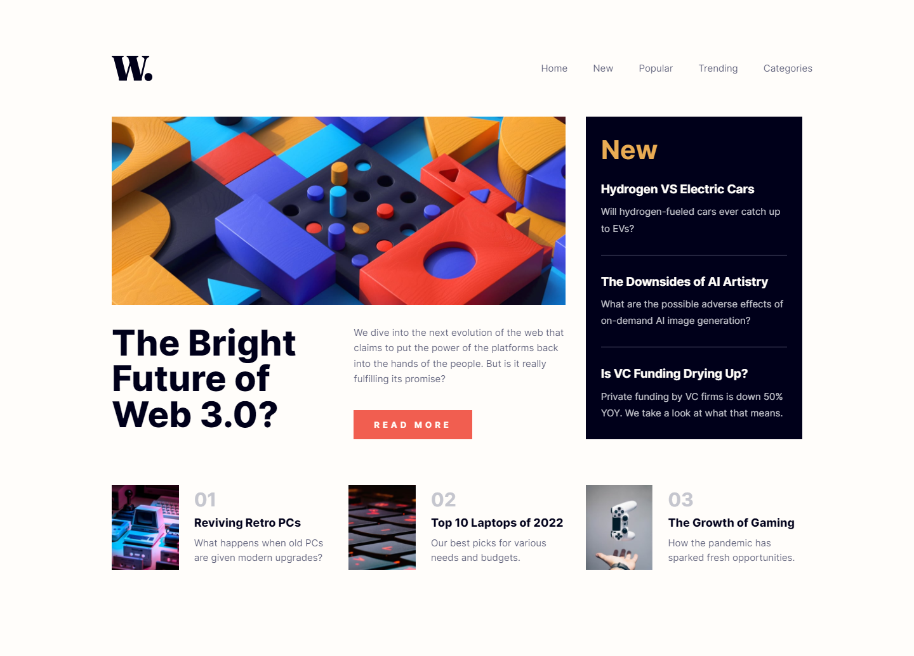

# Frontend Mentor - News homepage solution

This is a solution to the [News homepage challenge on Frontend Mentor](https://www.frontendmentor.io/challenges/news-homepage-H6SWTa1MFl). Frontend Mentor challenges help you improve your coding skills by building realistic projects. 

## Table of contents

- [Overview](#overview)
  - [The challenge](#the-challenge)
  - [Screenshot](#screenshot)
  - [Links](#links)
- [My process](#my-process)
  - [Built with](#built-with)
  - [What I learned](#what-i-learned)
  - [Continued development](#continued-development)
  - [Useful resources](#useful-resources)
- [Author](#author)

## Overview

### The challenge

Users should be able to:

- View the optimal layout for the interface depending on their device's screen size
- See hover and focus states for all interactive elements on the page

### Screenshot



### Links

- HTML Solution: [HTML](https://github.com/JustANipple/news-homepage/blob/master/index.html)
- SCSS Solution: [SCSS](https://github.com/JustANipple/news-homepage/blob/master/styles/style.scss)
- JS Solution: [JS](https://github.com/JustANipple/news-homepage/blob/master/scripts/script.js)
- Live Site URL: [LIVE](https://justanipple.github.io/news-homepage/)

## My process

### Built with

- Semantic HTML5 markup
- CSS custom properties
- Flexbox
- CSS Grid
- Mobile-first workflow
- SCSS
- JavaScript

### What I learned

#### SCSS components
Being able to organize the code in the right folders and giving proper names is essentials when the challenge/website will be larger.
I tried to make different components for each part of the challenge, making it easier, at least for myself, to manage and to modify in the future. It might be useful to copy these components to avoid writing these blocks again

#### lock scrolling on open dropdown menu
When in mobile view, i noticed that with the dropdown menu open i could still scroll down, making the page break its layout, so i figured out i could hide the overflow of the body to make the page unscrollable until the dropdown menu is open

```js
document.body.style.overflow= "hidden";
```

### Continued development

My new focus will be abstract components. I start seeing how components keep getting repeated over and over again with very few changes between one or another. Having a template that can save me save time and provide the best responsiveness would be an improvement for me

### Useful resources

- [Block scrolling](https://blog.hubspot.com/website/hide-scrollbar-css) - This made possible to lock scrolling when dropdown menu is open
- [The "@use" rule](https://sass-lang.com/documentation/at-rules/use) - I discovered that it's better to use the "@use" rule instead of @import to get components from others sources

## Author

- Frontend Mentor - [@JustANipple](https://www.frontendmentor.io/profile/JustANipple)
